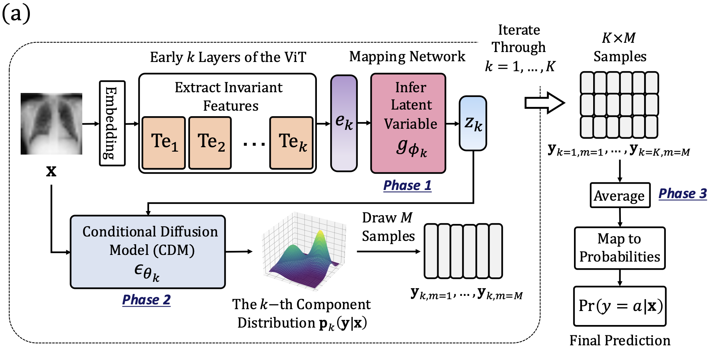

<h1 align="center">
Improving Robustness and Reliability in Medical Image Classification with Latent-Guided Diffusion and Nested-Ensembles
</h1>

<p align="center">
  <a href="https://arxiv.org/abs/2310.15952"></a>
  <a href="./assets/citation.bib"></a>
  <a href="https://www.python.org/"></a>
  <a href="https://pytorch.org/"></a>
</p>

This repository contains the official implementation of the paper:
> __Improving Robustness and Reliability in Medical Image Classification with Latent-Guided Diffusion and Nested-Ensembles__  
> [Xing Shen](https://scholar.google.com/citations?hl=en&user=U69NqfQAAAAJ), [Hengguan Huang](https://scholar.google.com/citations?hl=en&user=GQm1eZEAAAAJ), [Brennan Nichyporuk](https://scholar.google.com/citations?user=GYKrS-EAAAAJ&hl=en), [Tal Arbel](https://www.cim.mcgill.ca/~arbel/)  
> _IEEE Transactions on Medical Imaging, 2025_  
> __Paper ([arXiv preprint](https://arxiv.org/abs/2310.15952) / [IEEE Xplore Early Access](https://ieeexplore.ieee.org/document/11059995)), [BibTeX](./assets/citation.bib)__

## Overview
Once deployed, medical image analysis methods are often faced with unexpected image corruptions and noise perturbations. These unknown covariate shifts present significant challenges to deep learning based methods trained on “clean” images. This often results in unreliable predictions and poorly calibrated confidence, hence hindering clinical applicability. To address this challenge, we propose **LaDiNE**, a novel probabilistic ensemble framework that integrates invariant feature extraction with diffusion models to improve robustness and uncertainty estimation.
<p align="center">
  
</p>

## 1. Preparation
### 1.1 Installation
It is recommended to use a virtual environment (e.g., `venv`) to avoid package conflicts. Here we assume you are using `venv` as your virtual environment. The requirements are listed in `requirements.txt`. You can install them using the following command (if you are using conda, please adjust the commands accordingly):
```bash
git clone https://github.com/xingbpshen/nested-diffusion.git
cd nested-diffusion/
pip install -r requirements.txt
```

### 1.2 Downloading data
The datasets used in this work are publicly available, however, due to the license policy, we cannot provide the data directly. You can download the datasets from the following links:
- Tuberculosis chest X-ray: [README.md in SEViT](https://github.com/faresmalik/SEViT) or [Kaggle](https://www.kaggle.com/datasets/tawsifurrahman/tuberculosis-tb-chest-xray-dataset)
- Melanoma skin cancer: [ISIC](https://challenge2020.isic-archive.com/) or [Kaggle](https://www.kaggle.com/datasets/hasnainjaved/melanoma-skin-cancer-dataset-of-10000-images/data)

## 2. Training
Before proceeding, please ensure that at least one GPU with CUDA support and a memory capacity exceeding 40 GB is available.

Throughout the process, we will use the environment variable `${DATASET}` to get the dataset name. You can set this by:
```bash
export DATASET={DATASET}
```
where `{DATASET}` is the dataset name (e.g., `ChestXRay` or `ISICSkinCancer`).

Please also keep the data directory handy, as you will need to provide the path to the data directory in the training command and configuration files. We will use another environment variable `${DATA_DIR}` to get the data directory, you can set it by:
```bash
export DATA_DIR={DATA_DIR}
```
where `{DATA_DIR}` is the path to the data directory of the `{DATASET}` you want to use.

In addition, please modify the `data.dataroot` in the configuration files in the `nested-diffusion/diffusion/configs` directory to the path of the data directory `${DATA_DIR}`.

### 2.1 Training Mapping Networks
We are now in the root directory `nested-diffusion`, please go to the `nested-diffusion/mapping` directory:
```bash
cd mapping
```
#### 2.1.1 Training transformer encoder blocks
```bash
python train_transformer.py --dataset ${DATASET} --root_dir ${DATA_DIR}
```
Here, `${DATASET}` is the dataset name (e.g., `ChestXRay` or `ISICSkinCancer`). As mentioned previously, you need to provide the path to the data directory `${DATA_DIR}`.
#### 2.1.2 Training mapping MLPs
```bash
python train_mapping.py --dataset ${DATASET} --root_dir ${DATA_DIR} --mn_idx {MN_IDX}
```
Here, `${DATASET}` and `${DATA_DIR}` are from the previous step, `{MN_IDX}` is the index of the mapping network (e.g., `0`, `1`, `2`, `3`, `4`). Make sure to run this step for all mapping networks `0 - 4`.

### 2.2 Training Conditional Diffusion Models
After training the mapping networks, we can train the conditional diffusion models. We are now in the root directory `nested-diffusion`. 

Run the bash script to move files:
```bash
bash make_files.sh
```
Please go to the `nested-diffusion/diffusion` directory and run the bash script to train the conditional diffusion models for the dataset `${DATASET}`: 
```bash
cd diffusion
bash training_scripts/train.sh
```
After the whole training process is finished, you can find the trained models in the `nested-diffusion/diffusion/results` directory.

Please look at the configuration files in the `nested-diffusion/diffusion/configs`, you can see that the field `diffusion.trained_diffusion_ckpt_path` is set to the path of the trained diffusion models. You need to modify this field to the path of the trained diffusion models. Here is an example:
```
diffusion:
    trained_diffusion_ckpt_path: [["./results/chest_x_ray/.../diffu0_ckpt_best...pth",
                                   "./results/chest_x_ray/.../diffu1_ckpt_best...pth",
                                   ...,
                                   "./results/chest_x_ray/.../diffu4_ckpt_best...pth"]]
```

## 3. Evaluation
Once we follow all the steps in the training section, we can evaluate the trained models. We are now in the root directory `nested-diffusion`.

Please go to the `nested-diffusion/diffusion` directory:
```bash
cd diffusion
```
Run the bash script to evaluate the trained models for the dataset `${DATASET}`:
```bash
bash testing_scripts/test.sh
```
The above testing script has some customizable parameters, we can modify them in the script before running it. Here is an example of testing it with the noise perturbation level of `0.5`:
```
export NOISE_PERTURBATION=0.5
```

## Acknowledgements
This work was supported in part by the Natural Sciences and Engineering Research Council of Canada (NSERC), in part by the Canadian Institute for Advanced Research (CIFAR) Artificial Intelligence Chairs Program, in part by the Mila—Quebec Artificial Intelligence Institute Technology Transfer Program, in part by the Mila—Google Research Grant, in part by Calcul Quebec, in part by the Digital Research Alliance of Canada, and in part by the Canada First Research Excellence Fund, awarded to the Healthy Brains, Healthy Lives initiative at McGill University. This repository contains code adapted from repositories [CARD](https://github.com/XzwHan/CARD) and [SEViT](https://github.com/faresmalik/SEViT). We thank to the above repositories' authors for their great work.

## Citation
If you find this repository useful in your research, please cite our paper:
```
@article{shen2025improving,
  title={Improving robustness and reliability in medical image classification with latent-guided diffusion and nested-ensembles},
  author={Shen, Xing and Huang, Hengguan and Nichyporuk, Brennan and Arbel, Tal},
  journal={IEEE Transactions on Medical Imaging},
  year={2025},
  publisher={IEEE}
}
```

## Contact
Please raise a GitHub issue or email us at <a href="mailto:xing.shen@mail.mcgill.com">xing.shen@mail.mcgill.com</a> (with the email subject starting with "[LaDiNE]") if you have any question or encounter any issue.

## References
- Han, X., Zheng, H., & Zhou, M. (2022). Card: Classification and regression diffusion models. Advances in Neural Information Processing Systems, 35, 18100-18115.
- Almalik, F., Yaqub, M., & Nandakumar, K. (2022, September). Self-ensembling vision transformer (sevit) for robust medical image classification. In International Conference on Medical Image Computing and Computer-Assisted Intervention (pp. 376-386). Cham: Springer Nature Switzerland.
